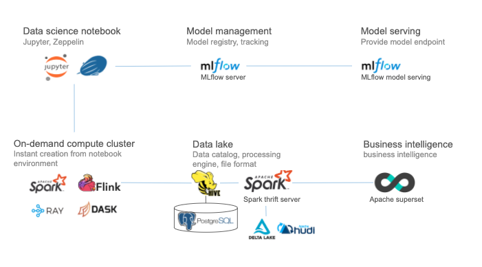

Overview
==================================

Open Data Studio (ODS) provides integrated environments for data analytics and machine learning.
It integrates open-source tools to build complete data processing and ML pipeline on Kubernetes.

|overview-img|

.. include:: ../ref.rst

