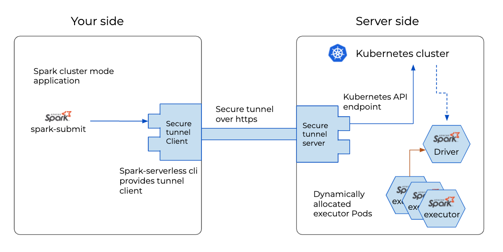

================
Spark serverless
================

Apache Spark is a unified analytics engine for large-scale data processing.
Open data studio provides instant access to the Spark cluster from anywhere without thinking about infrastructure and maintenance.

Key features

  - No infra setup required
  - Spark 3.0
  - Create spark cluster on Kubernetes on-demand
  - Connect from anywhere through secure tunnel

=============================== ===================================================================
Open data studio repository     https://github.com/open-datastudio/spark-serverless
Original repository             https://github.com/apache/spark
Documentation                   https://spark.apache.org/docs/latest/
=============================== ===================================================================

Spark serverless Quickstart
---------------------------

 - `Spark serverless on Google Colab <https://colab.research.google.com/github/open-datastudio/spark-serverless/blob/master/notebooks/Spark_serverless_on_Colab.ipynb>`_

Usage
-----

 - See `README <https://github.com/open-datastudio/spark-serverless/blob/master/README.md#how-to-use-staroid>`_ of the project

How it works
------------

`Spark on Kubernetes <http://spark.apache.org/docs/latest/running-on-kubernetes.html>`_ both provides Spark client mode and Cluster mode. That means if your spark application have access to Kubernetes API server, your application can create driver and executors itself.

Therefore, this project more focuses on providing Kubernetes API endpoint to the Spark application, 
with optimized Spark configuration for the Kubernetes and each cloud platform providers.

     Spark client mode application

         |spark-serverless-client|

     Spark cluster mode application

         |spark-serverless-cluster|

.. include:: ../../ref.rst

.. |spark-serverless-client| image:: ../../_static/spark-serverless-client-mode.png
   :width: 700px
   :alt: Spark serverless client mode

