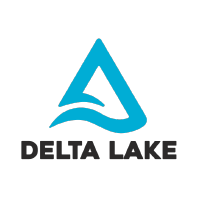
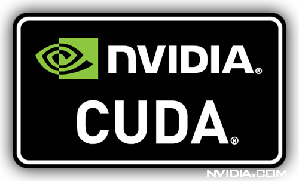

|ods-logo| Open Data Studio
==================================

Open data studio is a managed computing service on Staroid_ cloud. Run your machine learning workloads without managing clusters and servers.

|

Technology
------------

Use all the latest machine learning technology in a single place.
Open data studio continues to integrate the best technologies for machine learning.

|spark-logo| |ray-logo| |delta-logo| |cuda-logo| |jupyter-logo| |zeppelin-logo|

.. |spark-logo| image:: ./_static/spark-logo.png
   :width: 80px
   :alt: Apache spark

.. |ray-logo| image:: ./_static/ray-logo.png
   :width: 100px
   :alt: Ray

.. |jupyter-logo| image:: ./_static/jupyter-logo.png
   :width: 60px
   :alt: Jupyter notebook

.. |zeppelin-logo| image:: ./_static/zeppelin-logo.svg
   :width: 80px
   :alt: Zeppelin notebook

|

Easy of use
-----------

Access to the latest machine learning technology shouldn't be more than a few clicks or a few lines of code away.

.. code-block:: python
   :caption: Learn more about :ref:`Spark cluster from your python environment`

   # import open data studio library
   import ods

   # create a spark cluster on the cloud with 3 initial workers
   spark = ods.spark("my-spark", worker_num=3).session()

   # run spark task
   df = spark.read.load("...")

.. code-block:: bash
   :caption: Learn more about :ref:`Ray cluster from Ray Cluster Launcher CLI`

   $ # install ray and staroid package
   $ pip install ray staroid kubernetes

   $ # switch to nightly build
   $ ray install-nightly

   $ # get autoscaler yaml files
   $ git clone https://github.com/ray-project/ray.git

   $ # spin-up cluster on the cloud and attach
   $ ray up ray/python/ray/autoscaler/staroid/example-full.yaml
   $ ray attach ray/python/ray/autoscaler/staroid/example-full.yaml

|

Fully managed
-------------

Save time and reduce risk.
Open data studio is maintained by the committers of the open source project and industry experts
on top of secure, reliable, and high performance cloud platform Staroid_.

|

Open source
-----------

Open data studio is an open source project.
You can easily see source code, understand how it works, and get involved.
When you need, fork and get your own version of managed service!

Also, every time you launch projects, developers of the projects get funded via StarRank_.

|

.. toctree::
   :maxdepth: 2

   about/index
   notebook/index
   data-lake/index
   computing/index
   machine-learning/index
   business-intelligence/index

.. include:: ./ref.rst

.. |ods-logo| image:: ./_static/open-datastudio-logo.png
   :width: 60px
   :alt: Open Datastudio
